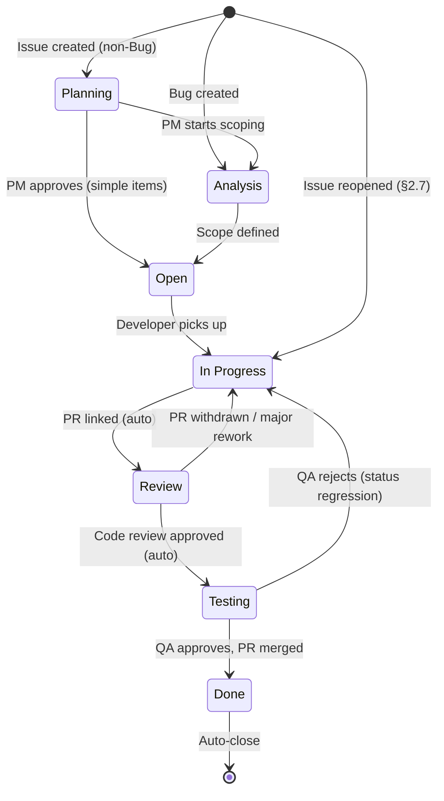
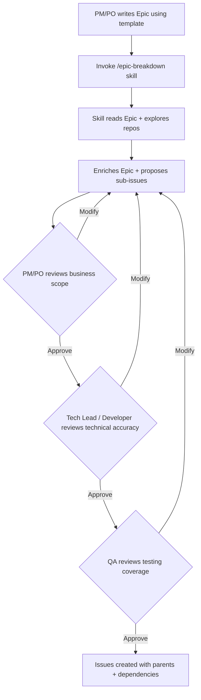

# ILM Development Management Methodics

**Version:** 1.0
**Date:** 2026-04-15
**Organization:** OmniTrustILM (https://github.com/OmniTrustILM)
**Project:** https://github.com/orgs/OmniTrustILM/projects/5

This document is the **single source of truth** for how development is managed in the ILM project. All team members, automation, and AI agents should reference this document for process decisions.

---

## Quick Start

You've opened this doc. Jump to the section for your role:

### Developer
1. Pick an issue from the **Sprint Board** (view filtered to `Sprint: current`, `Assignees: @me`). Status **Open** = ready to work.
2. Move to **In Progress**, commit, open a PR that references the issue (e.g., `Closes #123`).
3. PR linked → Status moves to **Review** automatically. Address review feedback in the same PR.
4. Code review approved → Status moves to **Testing** automatically. Wait for QA.
5. QA approves → merge the PR. Status moves to **Done**, issue auto-closes.
6. **Never** close code issues manually. If QA rejects, they move Status back to **In Progress** — fix and push again.
7. Post-merge reopen (regression discovered later): fix in a new PR, full cycle repeats.

### PM / Tech Lead
1. Triage new issues daily: scope Bugs (already in **Analysis**), move future work from **Planning → Analysis**, set Priority/Version/Module/Sprint during planning.
2. Assign Module and Version during planning (see Section 3 for options). Epic: also set Complexity/Estimate/Start Date/End Date before moving past Planning.
3. Run `/project-triage` weekly to surface stale items and missing required fields.

### QA
1. Watch the **QA Board** — issues in **Testing** status are ready for you to verify (PR branch is merge-ready, awaiting QA sign-off before merge).
2. Approve → developer merges. Reject → move Status back to **In Progress** and comment with findings.
3. Post-merge regression → open a new issue OR reopen the original; set **Reopen Reason** to Regression.

### AI Agent
1. Autonomous: read issues, generate reports, suggest breakdowns, validate triage, auto-detect Module from description.
2. Human approval required before: creating issues, modifying fields on existing issues, closing issues, setting Version/Sprint/Priority.
3. Read Section 10 for the full permission split.

### "Where do I …?" cheatsheet

| Question | Section |
|---|---|
| What's the difference between Epic and Feature? | §1 |
| When does an issue automatically change status? | §2.1, §6 |
| Who sets which field? | §2.3, §3.1 |
| What do I do if QA rejects after merge? | §2.7 |
| How are Bug, Vulnerability, QA work, Documentation distinguished? | §1 |
| What triggers auto-close? | §2.4, §6 |
| Can I create a Feature inside a Feature? | §1 (no — split the Epic) |
| How is Module picked for a new issue? | §3.1 Module row |

---

## Glossary

Conceptual terms only. For field types and values (Module, Version, Sprint, Priority, Severity, Complexity, Reopen Reason, Estimate, Start/End Date), see Section 3.

| Term | Definition |
|---|---|
| **Issue state** | GitHub's native `open` or `closed`. Controlled by automation when Status = Done, or manually as "not planned" / "duplicate". Distinct from Status below. |
| **Status** | Our **custom Project #5 field** — the 7-stage workflow (Planning → Analysis → Open → In Progress → Review → Testing → Done). Status drives state: when Status = Done, automation closes the issue. |
| **Status regression** | Moving an issue's Status *backwards* (e.g., Testing → In Progress when QA rejects pre-merge). The issue stays open — NOT a reopen event. See §2.7. |
| **Reopen** | GitHub `issues.reopened` event — a closed issue being re-opened after merge (e.g., regression found after release). Triggers the reopen-tracking automation (§6 Rule #2). |
| **Epic** | Issue type — a large deliverable with a User Story and Use Cases, decomposed into Features / Tasks / Bugs as sub-issues. Cannot contain sub-Features (that signals the Epic is too large — split it). |
| **Release** | Issue type — a cross-repo milestone (e.g., "Release 2.18.0"). Parent of Epics and standalone work targeted at that version. |
| **Project #5** | The single org-wide GitHub Project V2 at https://github.com/orgs/OmniTrustILM/projects/5. All ILM work lives here — every open issue across the 60+ org repos is added automatically. |
| **Composite action** | Reusable automation logic hosted in `OmniTrustILM/.github/.github/actions/<name>/`. Invoked from caller workflows in each target repo. See §6. |
| **Caller workflow** | A small `.github/workflows/issue-automation.yml` or `release-automation.yml` file that lives in every org repo. Wires GitHub `issues` / `release` event triggers to the composite actions in the central `.github` repo. |

---

## 1. Issue Types

Five org-level issue types:

| Type | Purpose | Created by | Can contain |
|---|---|---|---|
| **Release** | Cross-repo milestone — a version of the platform to ship | PM / Tech Lead | Epics, standalone Features/Bugs/Tasks |
| **Epic** | Large deliverable with user story and use cases | PM / Tech Lead / PO | Features, Tasks, Bugs as sub-issues |
| **Feature** | New functionality or enhancement | Anyone | Tasks and Bugs (implementation details); NOT sub-Features — split the Epic instead |
| **Bug** | Unexpected problem or incorrect behavior | Anyone | Reactive — describe what's broken |
| **Task** | Specific work item (docs, infra, config, non-code) | Anyone | Does not necessarily involve code |

**Special-purpose labels** extend issue types without adding type overhead:
- **Vulnerabilities** use the Bug type with a `vulnerability` label. The Vulnerability template captures security-specific fields (source type, CVE, remediation).
- **QA work** (testing framework, strategy, automation) uses the Task type with a `qa` label. The QA template captures test-specific fields (test scope, related feature).
- **Documentation** uses the Task type with a `documentation` label. The Documentation template captures doc-specific fields (doc type, related feature, pages to update).

### Issue Hierarchy

In the diagram below, `[bracketed]` text indicates the **target repo** where the issue lives, not the Module field value. (Module is a separate single-select field — see §3.1.)

```
Release 2.18.0
├── Epic: Certificate Revocation Redesign
│   ├── Feature [interfaces]: New revocation DTOs
│   │   ├── Task: Implement DTO validation
│   │   └── Bug: Fix serialization edge case
│   ├── Feature [core]: Revocation service
│   ├── Feature [fe-administrator]: Revocation UI
│   ├── Task+documentation [documentation]: Revocation user guide
│   ├── Task+qa [automated-testing-framework]: E2E revocation tests
│   └── Bug [core]: Legacy revocation edge case
├── Epic: CBOM Enhancements
│   └── ...
├── Bug [fe-administrator]: Standalone bug
└── Task [helm-charts]: Standalone task
```

- Releases contain Epics and optionally standalone issues
- Epics contain Features, Bugs, Tasks (including QA and Documentation-labeled Tasks)
- Features can contain Tasks and Bugs as implementation details (small sub-work discovered during development). **A Feature must NOT contain sub-Features** — this signals the Epic is too large and should be split.
- Sub-issues receive Version and Module from parent at creation time (automation copies if child's fields are empty; does not update if parent changes later — see Section 6, Rule #2)
- An issue can have only one parent
- **Breakdown guideline:** If a Feature under an Epic needs its own sub-issues, this is a signal that the Epic may be too large. Consider breaking it into separate Epics, each with a focused scope. A well-sized Epic has Features/Tasks that are directly implementable without further decomposition.
- **Cross-repo work:** Changes that touch 2+ repositories should be structured as an Epic for proper dependency tracking via sub-issues and blocked-by relationships. **Exception:** Trivial cross-repo changes (config updates, version bumps, dependency alignment) can use linked standalone issues without an Epic — use `blocked-by` links between them for ordering.
- **Dependencies:** Use GitHub's native issue dependency feature (`blocked-by` / `blocks`) to express ordering between issues. The `/epic-breakdown` skill sets these automatically when creating sub-issues. The consistency rule "Blocked but In Progress" (§7.2) flags issues being worked on while their blockers are still open.

---

## 2. Development Lifecycle

### 2.1 Issue Status State Diagram



**Legend:**
- `(auto)` — automation moves the status (built-in project workflows or composite actions, see §6)
- `(status regression)` — a human moves the status backwards; issue stays **open**
- `Issue reopened` — GitHub `issues.reopened` event on a previously-closed issue; see §2.7 for the full flow
- `PR withdrawn / major rework` — if a linked PR turns out to be a draft or needs substantial changes, the developer manually moves Review → In Progress

| Status | Definition |
|---|---|
| **Planning** | Future work acknowledged, visible in project. Not yet scoped. May have a Version assigned for roadmap planning, but not required. |
| **Analysis** | Actively being scoped — acceptance criteria, technical analysis, sub-issue creation. For Bugs: initial triage. |
| **Open** | Fully specified, ready for a developer to pick up. |
| **In Progress** | Developer actively working. Includes addressing code review feedback. |
| **Review** | PR submitted and linked. Code review in progress (includes back-and-forth until approval). **Note:** Draft PRs should not be linked until ready for review — linking triggers the status transition. |
| **Testing** | Code review approved. QA testing the PR branch — locally or via `preview` label environment. PR is **NOT yet merged**. Main branch stays stable. |
| **Done** | QA approved, PR merged to main, issue auto-closed. |

> **Pre-development status philosophy:** Planning is the backlog (long-lived, 90-day threshold). Analysis is the active triage/scoping workspace (short-lived, 14-day threshold). Open is the developer-ready queue (21-day threshold). Not all types use all three — the convention table below shows the default path.

> **Analysis is not exclusively PM work.** For Bugs, QA may triage and move to Open. For technically complex issues, the Tech Lead or assigned developer may perform the analysis (root cause identification, correct repo, impact assessment). The PM retains authority over business prioritization (Priority, Version, Sprint) regardless of who performs the technical analysis. For simple items (obvious fix, trivial scope), the person triaging may move from Analysis to Open immediately — Analysis is a triage inbox, not a mandatory waiting period.

> **Key change:** QA testing happens BEFORE merge, not after. The Testing status means "QA is verifying the PR branch." Only after QA approves does the PR get merged and the issue moves to Done. This keeps the main branch stable.

### 2.2 Convention by Issue Type

| Issue Type | Lifecycle | Notes |
|---|---|---|
| **Feature** | Planning → Analysis → Open → In Progress → Review → Testing → Done | Full 7-stage |
| **Bug** | Analysis → Open → In Progress → Review → Testing → Done | Skips Planning — bugs are reactive |
| **Task** (non-code) | Planning → Open → In Progress → Done | No Review/Testing needed |
| **Task** (code / QA) | Planning → Open → In Progress → Review → Testing → Done | Fuller lifecycle; QA-labeled Tasks follow this path |
| **Task** (documentation) | Planning → Open → In Progress → Done | No Review/Testing unless docs require PR review |
| **Epic** | Planning → Open → In Progress → Done | Breakdown happens **during Planning** (see §2.6): PM writes/refines User Story and Use Cases, enriches Acceptance Criteria and Technical Analysis (via `/epic-breakdown`), creates sub-issues. PM moves to Open when breakdown is complete and all required fields are set (**Complexity, Estimate, Start Date, End Date** — required by §3.2 before leaving Planning). PM moves to In Progress when the first child starts development. Done when all children complete. All transitions manual. |
| **Release** | Planning → In Progress → Done | PM sets **Start Date** and **End Date** before moving past Planning (required by §3.2). PM moves to In Progress when development begins. PM moves to Done after QA sign-off (see Section 2.9). All transitions manual. |

**These are conventions, not hard enforcement.** The full pipeline is available for all types. For Tasks specifically: if a PR is linked, automation moves the Task through Review and Testing naturally. If no PR is involved (documentation, configuration via UI), the developer moves it directly to Done after completion.

### 2.3 Who Moves What (status transitions at a glance)

This table shows **status transitions only**. For full role responsibilities (fields, closure, triage, release duties), see Section 10.

| Actor | Transitions |
|---|---|
| **PM / Tech Lead** | Planning → Analysis → Open (all types); also Open → Planning when deferring (see §2.5 Triage step 2) |
| **Developer** | Open → In Progress (self-assign); Analysis → Open (after technical analysis); Review → In Progress (when a linked PR turns out to be a draft or needs major rework) |
| **QA** | Testing → Done (approves) or Testing → In Progress (rejects pre-merge); Analysis → Open (for Bugs, after reproduction check) |
| **Automation** | Added-to-project → Planning (default) or Analysis (Bugs); In Progress → Review (PR linked); Review → Testing (code review approved); Done → Close (auto-close); Reopened → In Progress (built-in project workflow) |

> **Product Owner and Code Reviewer** have no direct status transition rights — their outputs (acceptance criteria, review approval) flow into automation or into the transitions above.

### 2.4 Issue State (Open/Closed)

| State | When | Who |
|---|---|---|
| **Open** | Default for all active work | — |
| **Closed (completed)** | Status = Done (QA approved, PR merged) | Automation |
| **Closed (not planned)** | Won't fix / out of scope / not reproducible | PM or QA (for Bugs) |
| **Closed (duplicate)** | Duplicate found, linked | Anyone |
| **Reopened** | QA rejects or regression found | QA / Developer |

### 2.5 Process Flow

#### Creating an Issue

**Via template (standard):** Choose template, fill in fields. **Via `/create-issue` skill (quick):** Natural language description, skill detects type and fills fields.

Both paths: issue auto-added to Project #5, status set to Planning (or Analysis for Bugs).

#### Triage and Planning

1. PM reviews Backlog view (Status: Planning)
2. Move to Analysis to scope, leave in Planning for later, or close as "not planned"
3. During Analysis: define acceptance criteria, write user stories (Epics), assess impact (Bugs), create sub-issues
4. Set Priority, Module, Version, Sprint
5. Move to Open when fully scoped

#### External / Community Contributions

When a PR is submitted by an external contributor without a linked issue:

1. Analyze the PR to understand what it addresses (bug fix, feature, improvement)
2. Create an appropriate issue retroactively based on the PR analysis — the `/create-issue` skill can help generate the issue from the PR description
3. Link the PR to the newly created issue so automation picks up the normal flow

#### Development

1. Developer self-assigns from Sprint Board (Open), moves to In Progress
2. Opens PR, links to issue → automation moves to **Review**
3. Code review cycle: changes requested → developer fixes → re-review → approval
4. Code review approved → automation moves to **Testing**

#### Testing (QA before merge)

Once code review is approved, QA tests the PR branch before it is merged:

1. QA picks up the issue from the QA Board (Status: Testing)
2. QA tests the PR branch — either locally or by adding the `preview` label to create a testing environment for the PR
3. Automated smoke tests run on the PR branch (see `docs/testing.md`)
4. **Pass:** QA approves the PR → developer merges → automation moves to **Done** → issue auto-closed
5. **Fail:** QA rejects the PR (requests changes) → QA moves status back to **In Progress** → developer fixes, cycle repeats from step 2 of Development

> **Note on terminology:** In the pre-merge testing model, QA rejection is a **status regression** (Testing → In Progress), not a GitHub issue reopen — the issue was never closed. The Reopen Process (Section 2.7) applies when a previously closed/Done issue needs to be reopened (e.g., regression found after release). For pre-merge QA rejection, QA moves the status backward and the Reopen Reason field is not set — it's a normal review cycle, not a quality metric event.

> **Main stays stable.** Code is only merged after both code review and QA approval. Regression tests run daily as a complement to pre-merge QA testing (see Section 2.8).

### 2.6 Epic Breakdown

> **Status:** the `/epic-breakdown` skill described below is **planned, not yet built**. Until it ships, Phase 2 is a manual exercise: PM/Tech Lead writes Acceptance Criteria, Technical Analysis, Impact Assessment, and creates sub-issues by hand. The shape and review flow described here remain the target for the skill.

Three-phase process with PM and QA review:

**Phase 1 — Human writes the Epic:** PM, Tech Lead, or Product Owner creates Epic via template. Fills in User Story, Use Cases, Constraints, Out of Scope, Testing Scope.

**Phase 2 — AI skill proposes breakdown:** `/epic-breakdown` reads the Epic, explores repos, generates Acceptance Criteria + Technical Analysis + Impact Assessment + Testing Scope, proposes sub-issues by work stream (API, Backend, Frontend, Access Control, Testing, Documentation, Deployment). Each sub-issue includes type, target repo, description, acceptance criteria, Module, Complexity, suggested Estimate (with review buffer), blocked-by relationships, suggested assignee.

**Phase 3 — Review and approval (collaborative):**
1. **PM/PO reviews** all proposed sub-issues (business scope, prioritization, completeness)
2. **Tech Lead / assigned developer reviews** technical accuracy (correct repos targeted, complexity assessment, dependencies, missed changes)
3. **QA reviews** Task+qa sub-issues specifically (testing coverage, test strategy, whether manual or automated testing is needed)
4. All reviewers approve before sub-issues are created. This can be a single review meeting or async review.



### 2.7 QA Rejection vs Reopen — Two Different Processes

**Pre-merge QA rejection (status regression):**
When QA rejects a PR during the Testing status (before merge), this is a **status regression**, not a GitHub reopen — the issue was never closed.
1. QA requests changes on the PR
2. QA moves status from Testing back to **In Progress**
3. **Reopen Reason field is NOT set** — this is a normal review cycle, not a quality metric event
4. Developer fixes, opens updated PR, cycle repeats from Review

**Post-merge reopen (true reopen):**
When a previously closed/Done issue needs to be reopened — e.g., regression found after release, or a problem discovered in production after the issue was completed.

1. QA or developer reopens the issue (GitHub state: Closed → Open)
2. Automation posts an audit comment (timestamp, previous assignees, who reopened) and **clears** the Reopen Reason field so the reopener fills it fresh
3. Built-in project workflow moves Status → **In Progress**
4. **The reopener sets Reopen Reason** (Regression / Incomplete Implementation / Edge Case / Other) — this is the single source of truth for reopen-tracking metrics
5. If the original assignee is unavailable, PM reassigns
6. The developer (assignee) opens a **new PR** that references the same issue (`Closes #123` or `Fixes #123` in the PR body). Do NOT reuse the old merged PR; do NOT create a new issue for the same defect — the existing issue is the canonical home for the regression.
7. Full lifecycle cycle repeats on the new PR: In Progress → Review → Testing → Done → Close.
8. Reopen Reason remains set on the issue after it closes again — it is the metric, not a working state.

| Reason | Signal |
|---|---|
| Regression | Broke existing functionality after merge/release |
| Incomplete Implementation | Missing in-scope requirements discovered after delivery |
| Edge Case | Untested scenario found in production |
| Other | Doesn't fit above |

**Reopen tracking is a quality metric, not a punishment.** Metrics (reopen rate per developer/Module/Version, reason distribution, trends) are derived from the Reopen Reason field + timeline API. Pre-merge QA rejections are NOT tracked via Reopen Reason — they are a normal part of the review cycle.

**Multiple PRs for one issue:** the default expectation is one PR per issue. When a post-merge reopen requires a fix PR, a second PR on the same issue is legitimate and does not require splitting into sub-issues. Status automation fires on the most recently linked PR.

### 2.8 Testing Strategy

This section provides a brief overview. For full details, see `docs/testing.md`.

**Pre-merge testing (per PR):**
- Automated smoke tests run on the PR branch as part of CI
- QA manually tests the PR branch (locally or via `preview` environment)
- QA must approve the PR before it can be merged

**Post-merge testing (complement):**
- Daily scheduled regression test suite runs against main branch
- Results are reviewed by QA team
- Regressions found trigger new Bug issues following the standard lifecycle

**Epic-level testing:**
Every Epic includes a Testing Scope section (filled by PM and enriched by `/epic-breakdown` skill):
- Manual testing required? (yes/no)
- E2E automation required? (yes/no)
- Existing tests need updating? (yes/no)
- Regression risk — what might break?

### 2.9 Release Process

This section provides a brief overview. For full details, see `docs/release-process.md`.

**Release flow:**

1. PM creates Release issue in Planning, assigns Epics, sets Version
2. Development progresses, tracked via Release Planning and Roadmap views
3. All child issues reach Done (code merged, individually QA-tested)
4. PM verifies all child issues are Done (via Release Planning view / Sub-issues progress)
5. **QA sign-off process:**
   - Smoke tests pass on integrated build
   - Regression test suite passes
   - Lead QA confirms: all critical bugs are fixed
   - PM reviews known open bugs (if any) and decides to accept or defer
6. PM moves Release to Done
7. GitHub Releases published on repos → automation stamps Version on un-tagged Done issues

**Known open bugs:**
If a release has known open bugs that are accepted (not blocking release):
- PM documents them in the Release issue's "Known Issues" section with links and rationale
- Each known bug is reparented from the current Release to the next Release issue (or made standalone if no next Release exists yet), and its Version field is updated to the next release
- The decision to ship with known issues is made by PM with QA input, documented on the Release issue
- This avoids triggering the "Version mismatch" consistency rule — deferred bugs always match their parent Release's Version

---

## 3. Project Fields

### 3.1 Field Definitions

**Built-in fields** (provided by GitHub, not configurable):

| Field | Type | Description |
|---|---|---|
| **Title** | Text | Issue title — see naming conventions in Section 10 |
| **Assignees** | Users | Single assignee = primary developer responsible. For Epics: delivery owner. |
| **Status** | Single-select | Workflow stage: Planning, Analysis, Open, In Progress, Review, Testing, Done |
| **Labels** | Labels | Cross-cutting concerns and release notes categorization (see Section 4) |
| **Linked PRs** | Pull requests | PRs linked to the issue — triggers status automation |
| **Milestone** | Milestone | GitHub's per-repo milestones are not used. Cross-repo milestones are represented by the Release issue type (parent) + Version custom field. |
| **Repository** | Repository | Which repo the issue belongs to |
| **Reviewers** | Users | PR reviewers (populated via linked PRs) |
| **Parent issue** | Issue | Parent in the hierarchy (Release → Epic → sub-issues) |
| **Sub-issues progress** | Progress | Completion percentage of child issues |

**Custom fields** (configured on Project #5):

| Field | Type | Values | Description | Set by |
|---|---|---|---|---|
| **Module** | Single-select | 17 platform modules — see table below ¹ | Which functional module of the platform this issue belongs to. Aligned with the platform's audit logging module system. | Human or skill |
| **Version** | Single-select | Semantic versions (2.13.0, ..., extended as needed) | Which release version this issue is targeted for. Optional in Planning. | PM; propagated by automation |
| **Sprint** | Iteration | Named sprint iterations | Which sprint this issue is assigned to for execution | PM during sprint planning |
| **Priority** | Single-select | Low, Normal (default), High, Critical | How important relative to other issues. Normal assumed if unset. | PM during triage; QA can set for Bugs |
| **Severity** | Single-select | Minor, Major, Critical, Blocker | How severe the impact of a bug is (Bugs only) | Reporter at creation |
| **Complexity** | Single-select | Low, Medium, High | Technical difficulty indicator based on repos affected, API changes, migrations | Epic breakdown skill (auto); manually overridable |
| **Reopen Reason** | Single-select | Regression, Incomplete Implementation, Edge Case, Other | Why an issue was reopened — single source of truth for reopen tracking | QA/Developer when reopening |
| **Estimate** | Number | Mandays | Time estimate including buffer for review. For Epics: overall delivery estimate set by PM (not sum of children). For sub-issues: developer's estimate. | Developer; PM for Epics |
| **Start Date** | Date | — | Planned start date for Roadmap view | PM (Epics/Releases) |
| **End Date** | Date | — | Planned end date for Roadmap view | PM (Epics/Releases) |

**Deprecated fields** (kept temporarily for old views, to be deleted during cleanup):

| Field | Type | Reason |
|---|---|---|
| **Component** | Single-select (renamed from "Epic") | Replaced by Module field. 38 values were a mix of platform areas, work types, and provider types. Delete when old views are removed. |
| **Developer** | Single-select | Replaced by built-in Assignees. Delete when old views are removed. |

> **¹ Module values** — aligned with the platform's `Module` enum (defined in `Module.java` and `LogRecord-1.1.json` in the `core` repo, and the platform logging documentation):
>
> | # | Module | What it covers | Key repos | Audit log code |
> |---|---|---|---|---|
> | 1 | **Certificates** | Certificate lifecycle, inventory, RA profiles, authorities, groups | core | `certificates` |
> | 2 | **Keys** | Cryptographic keys, tokens, token profiles, crypto operations | core | `keys` |
> | 3 | **Secrets** | Secrets, vaults, vault profiles | core | `secrets` |
> | 4 | **Entities** | Entities, locations | core | `entities` |
> | 5 | **Discovery** | Certificate/resource discovery | core, ip-discovery-provider, ct-logs-discovery-provider, cryptosense-discovery-provider | `discovery` |
> | 6 | **Compliance** | Compliance profiles, rules, checks | core, x509-compliance-provider, script-compliance-provider | `compliance` |
> | 7 | **Protocols** | ACME, CMP, SCEP, protocol profiles | core, cert-manager-issuer | `protocols` |
> | 8 | **Auth** | Users, roles, permissions, Keycloak, OPA | auth, auth-opa-policies, keycloak-theme | `auth` |
> | 9 | **Workflows** | Rules, triggers, actions, executions | core | `workflows` |
> | 10 | **Core** | Connectors, credentials, attributes, notifications, settings, dashboard, approvals, scheduler, audit logs, metadata | core, scheduler | `core` + `approvals` + `scheduler` |
> | 11 | **CBOM** | Cryptographic Bill of Materials | cbom-lens, cbom-repository, core | — |
> | 12 | **Signing** | Digital signing, CSC, AdES, TSA | csc-api, tsa-component | — |
> | 13 | **Connectors** | All connector/provider repos | ejbca-ng-connector, ejbca-legacy-ca-connector, ms-adcs-connector, pyadcs-connector, hashicorp-vault-connector, common-credential-provider, software-cryptography-provider, email-notification-provider, webhook-notification-provider, keystore-entity-provider | — |
> | 14 | **Frontend** | Web UI, UX design | fe-administrator, fe-operator, frontend, ui-design | — |
> | 15 | **Infrastructure** | Helm, appliance, Ansible, deployment, operator | helm-charts, appliance, ansible-role-*, operator | — |
> | 16 | **SaaS** | Multi-tenant SaaS infrastructure, provisioning | saas-*, provisioning-rabbitmq | — |
> | 17 | **Agent** | MCP server, AI integration | mcp-server | — |

### 3.2 Required Fields and Triage Rules

One consolidated table. **Error** = blocks triage. **Warning** = flagged but not blocking.

| Field | Issue types | Triage severity | When required |
|---|---|---|---|
| Severity | Bug | Error | At creation |
| Acceptance Criteria | Epic | Error | Before Open |
| Acceptance Criteria | Feature | Error | Before Open |
| User Story | Epic | Error | Before Open |
| Use Cases | Epic | Error | Before Open |
| Empty Epic (no sub-issues) | Epic | Error | Before moving to Open (sub-issues created during Planning) |
| Complexity | Epic | Error | Required once past Planning status |
| Estimate | Epic | Error | Required once past Planning status |
| Start/End Date | Epic, Release | Error | Required once past Planning status |
| Version | Release | Error | At creation |
| Priority | Feature, Bug | Warning | Defaults to Normal if unset; PM or QA escalates during triage |
| Module | Feature, Epic, Task | Warning | Before Open |
| Module | Bug | Warning | Optional at creation, set during triage |
| Version | Bug, Feature, Task | Warning | Before sprint assignment; optional in Planning |
| Assignee | All except Release, Epic | Warning | Before sprint assignment; single assignee = primary developer |
| Assignee | Epic | Warning | Person owning Epic delivery (usually did the analysis) |
| Estimate | Bug, Feature, Task | Warning | Before sprint assignment |

### 3.3 Priority Definitions

| Priority | Definition | Response |
|---|---|---|
| **Critical** | Blocks release, affects production | Immediate — interrupt sprint |
| **High** | Important for current release | Current or next sprint |
| **Normal** | Standard work (implicit default when Priority is unset) | Schedule based on capacity |
| **Low** | Nice to have | When capacity allows |

### 3.4 Severity Definitions (Bugs only)

| Severity | Definition | Example |
|---|---|---|
| **Blocker** | System unusable, no workaround | Platform won't start, data loss |
| **Critical** | Major functionality broken | Cannot issue certificates |
| **Major** | Partially broken, workaround exists | Filtering broken, list still works |
| **Minor** | Cosmetic, minor inconvenience | UI alignment, typo |

### 3.5 Complexity and Estimate Suggestions

Complexity is auto-set by the Epic breakdown skill. Estimate suggestions include buffer for review process. Developer overrides are always the final value.

| Complexity | Heuristic | Suggested Estimate |
|---|---|---|
| **Low** | 1 repo, no API/DB changes, good tests | 1-2 mandays |
| **Medium** | 2-3 repos, or API change, or migration | 3-5 mandays |
| **High** | 4+ repos, breaking changes, or no tests | 5-10 mandays |

---

## 4. Labels

Standardized across all repos via `labels.yml` and label-sync automation.

| Label | Purpose | Applied by |
|---|---|---|
| `vulnerability` | Security vulnerability | Template, Mend, Dependabot |
| `qa` | QA testing framework / automation work | QA template |
| `documentation` | Documentation work | Documentation template, manual |
| `tech-epic` | Technical epic — used to mark Epics that group internal technical work (infra, refactors, tooling) rather than customer-facing features | Manual, on Epic issues |
| `ignore-for-release` | Exclude from release notes | Manual |
| `new-feature` | Wholly new functionality (manually applied to distinguish from enhancements in release notes) | Manual |
| `enhancement` | Improvement to existing functionality (auto-applied by Feature template; replace with `new-feature` if the Feature is wholly new) | Feature template |
| `bug` | Bug fix | Bug template |
| `refactoring` | Code quality | Manual |
| `dependencies` | Dependency updates | Renovate, Mend |
| `performance` | Performance related | Manual |
| `preview` | Staged/preview environment for PR testing | QA / workflow |
| `good first issue` | For newcomers | Manual |
| `help wanted` | Extra attention needed | Manual |

Labels are for cross-cutting concerns and release notes, not issue type classification.

**Release notes mapping** (`templates/release.yml`): on each GitHub Release, merged-PR titles are auto-grouped into the following categories by the labels on the issues they closed.

| Category | Trigger labels |
|---|---|
| ✨ New Features | `new-feature` |
| 🔧 Enhancements | `enhancement` |
| 🐛 Bug Fixes | `bug` |
| 🔒 Security | `vulnerability` |
| ⚡ Performance | `performance` |
| 🧪 QA & Testing | `qa` |
| 📖 Documentation | `documentation` |
| 📦 Dependencies | `dependencies` |
| 📋 Other | (everything else) |

Excluded entirely: PRs labeled `ignore-for-release` (chore, internal cleanup, doc-only fixes that should not appear in user-facing release notes). PMs and reviewers should not strip a label like `vulnerability` thinking it's only for project tracking — it is also what routes the entry into the Security section of release notes.

---

## 5. Issue Templates

Centralized in `.github` repo as YAML issue forms. Per-repo templates deleted.

### 5.1 Template List

Ordered by frequency, with role hints:

1. **Bug** — "Something is broken or behaving unexpectedly"
2. **Feature** — "Request new functionality or improve existing"
3. **Task** — "Non-feature work: config, infra, cleanup"
4. **Documentation** — "Create or update documentation"
5. **Vulnerability** — "Security concern in code, dependency, or image"
6. **Epic** — "Large deliverable requiring multiple sub-issues (PM only)"
7. **QA Issue** — "Testing framework or automation work (QA team only)"
8. **Release** — "Release milestone (PM only)"

Blank issues are enabled as an escape hatch. Contact links guide to Discussions and documentation (https://docs.otilm.com).

### 5.2 Template Field Details

> **"Required" has two different meanings — read this first.**
>
> - **Template "Required: Yes"** means the GitHub YAML form blocks issue submission until the field is filled. Applies at the moment of creation.
> - **Triage "Error" / "Warning"** in §3.2 applies at later lifecycle checkpoints (typically "Before Open" or "Before sprint assignment"). An issue that passes template validation can still fail triage later if, for example, a reporter fills "Steps to Reproduce" with a placeholder that doesn't actually reproduce the bug.
>
> The two are complementary: the template ensures something is provided; triage ensures it's substantive enough at the right moment.

**Bug** (type: Bug, labels: `bug`)

| Field | Type | Required | Description |
|---|---|---|---|
| Description | textarea | Yes | Clear description of the bug |
| Steps to Reproduce | textarea | Yes | Minimal steps to reproduce |
| Expected Behavior | textarea | Yes | What should happen |
| Actual Behavior | textarea | Yes | What actually happens |
| Severity | dropdown | Yes | Minor, Major, Critical, Blocker |
| Module | dropdown | No | Platform module (17 options); set during triage if not provided |
| Screenshot | upload | No | Screenshot showing the issue (.png, .jpg, .jpeg, .gif) |
| Logs | upload | No | Log files, error output, stack traces, or HTTP request/response (.log, .txt, .zip, .gz, .csv, .json) |
| Environment | textarea | No | Version, browser, OS, deployment method |

**Feature** (type: Feature, labels: `enhancement`)

| Field | Type | Required | Description |
|---|---|---|---|
| Description | textarea | Yes | What to add or change |
| User Story | textarea | No | "As a [role], I want [capability] so that [benefit]" — recommended for standalone features |
| Use Case | textarea | No | How this feature would be used |
| Acceptance Criteria | textarea | Yes | How we know this is done — checklist format recommended |

**Task** (type: Task)

| Field | Type | Required | Description |
|---|---|---|---|
| Description | textarea | Yes | What needs to be done |
| Definition of Done | textarea | No | How we know this task is complete |

**Documentation** (type: Task, labels: `documentation`)

| Field | Type | Required | Description |
|---|---|---|---|
| Description | textarea | Yes | What documentation needs to be created or updated |
| Documentation Type | dropdown | Yes | Platform Documentation, Contributors Guide, Integration Guide, API Documentation, README or Repo Docs, Other |
| Related Feature | input | No | Link to related feature issue |
| Pages to Update | textarea | No | Existing pages that need changes |

**Vulnerability** (type: Bug, labels: `vulnerability`)

| Field | Type | Required | Description |
|---|---|---|---|
| Source | dropdown | Yes | Dependency, Container image, Code, Configuration, Infrastructure |
| CVE ID | input | No | CVE identifier if applicable |
| Description | textarea | Yes | What is the vulnerability and its impact |
| Affected Components | textarea | Yes | Which services, images, or packages |
| Severity | dropdown | Yes | Minor, Major, Critical, Blocker |
| Remediation | textarea | No | Known fix, patch version, or workaround |

**Epic** (type: Epic)

| Field | Type | Required | Description |
|---|---|---|---|
| User Story | textarea | Yes | "As a [role], I want [capability] so that [benefit]" — the `so that` clause carries the "why"/business framing |
| Use Cases | textarea | Yes | Concrete scenarios with Actor, Precondition, Flow, Postcondition |
| Constraints | textarea | No | Security, performance, backwards compatibility requirements |
| Out of Scope | textarea | No | Explicitly what this Epic does NOT include |
| Testing Requirements | checkboxes | No | Manual testing required, E2E automation required, Existing tests need updating |
| Regression Risk | textarea | No | Describe what existing functionality might break |

> Sections filled by `/epic-breakdown` skill (planned — not yet available) after creation: Acceptance Criteria, Technical Analysis, Impact Assessment, enriched Testing Scope.

**QA Issue** (type: Task, labels: `qa`)

| Field | Type | Required | Description |
|---|---|---|---|
| Description | textarea | Yes | What testing work needs to be done |
| Test Approach | dropdown | No | Manual, Automated, Both |
| Test Scope | textarea | No | What functionality or area this covers |
| Test Scenarios | textarea | No | Step-by-step manual test scenarios; each scenario describes a concrete user action and expected result |
| Related Feature | input | No | Link to related feature issue |

**Release** (type: Release)

| Field | Type | Required | Description |
|---|---|---|---|
| Version Number | input | Yes | Semantic version (e.g., 2.19.0) |
| Target Date | input | No | Planned release date |
| Release Goals | textarea | No | High-level goals for this release |
| QA Sign-off Checklist | checkboxes | No | Smoke tests passed, Regression tests passed, No open Blocker bugs, Lead QA sign-off |
| Known Issues | textarea | No | Bugs accepted and deferred to next release — with links and PM rationale |

---

## 6. Automation Rules

Automation is split across three categories (see the design spec Section 7 for the full architecture):

- **Composite actions** hosted in `OmniTrustILM/.github/.github/actions/<name>/` — the reusable logic
- **Caller workflows** deployed to every org repo's `.github/workflows/` (`issue-automation.yml` + `release-automation.yml`) — wire triggers to composite actions, pinned to moving tags `@issue-automation-v1` and `@release-automation-v1`
- **Sync workflows** in `.github` — distribute the caller files, labels, and release.yml template to every repo

**Authentication:** All automation uses a GitHub App (`ilm-project-bot`) installed org-wide. Required permissions: Contents R/W, Pull requests R/W, Issues R/W, Workflows R/W (needed to push caller workflow files), Metadata R, Organization projects R/W, Organization members R. Secrets `ILM_PROJECT_BOT_APP_ID` and `ILM_PROJECT_BOT_PRIVATE_KEY` are **organization-level** secrets with All-repositories access (caller workflows in target repos read them via `secrets.*`).

| # | Trigger | Fires in | Action |
|---|---|---|---|
| 1 | `issues.opened` | target repo's `issue-automation.yml` | Calls 3 composite actions in sequence (guarded so failures don't cascade): **auto-add-to-project** (add to Project #5, Status → Planning or Analysis for Bugs), **auto-set-fields-from-form** (parse body for whichever form fields are present — typically Severity/Module on Bug, Module on Feature/Task, vulnerability defaults), **version-propagation** (copy Version/Module from parent if child empty). Version-propagation uses a separate org-wide App token because the parent issue may live in a different repo than the child. |
| 2 | `issues.reopened` | target repo's `issue-automation.yml` | Calls **reopen-tracking** composite action: post audit comment (timestamp, actor, previous assignees), clear Reopen Reason field so the reopener fills it fresh (automation clears; the human who reopens sets per Section 2.7). Status → In Progress by built-in project workflow. |
| 3 | PR linked to issue | built-in | Status → **Review** |
| 4 | Code review approved | built-in | Status → **Testing**. QA picks up for pre-merge testing. |
| 5 | PR merged | built-in | Status → **Done**. Fires after QA approves and developer merges. |
| 6 | Status → Done | built-in | Auto-close issue. Non-code Tasks may move to Done directly. |
| 7 | `release.published` (stable only) | target repo's `release-automation.yml` | Calls **post-release-stamping** composite action: stamp Version on closed Done issues in the **releasing repo** that were closed after the previous release's `published_at` and don't yet have a Version. Prereleases are skipped. **Limitation:** only issues in the releasing repo are stamped; sub-issues living in other repos (common in cross-repo Epics) will not be stamped. Primary mechanism for Version is PM assignment during sprint planning (§2.9) — this automation is a safety net, not a substitute. |
| 8 | Weekly cron (Mon 05:00 UTC) or manual | `.github` repo's `project-health-report.yml` | Health report as GHA artifact. Evaluates triage rules from `config/project-triage-rules.yml`. Report-only. |
| 9 | Push to `templates/labels.yml` on main | `.github` repo's `label-sync.yml` | Sync standard labels to all non-archived org repos (additive — does not delete). |
| 10 | Manual dispatch | `.github` repo's `repo-template-sync.yml` | Aligns every target repo with the org templates (release.yml + caller workflows) in one PR per repo (up to 2 commits, skipped if no drift). |
| 11 | Manual dispatch | `.github` repo's `release-yml-sync.yml` | Focused sync — opens PRs to adopt `templates/release.yml` as `.github/release.yml` in target repos (release.yml-only hotfix path). |

**Delivery to a target repo:** A maintainer dispatches `repo-template-sync.yml` from the `.github` repo Actions tab with `target_repos: all` (or a comma-separated subset) and `dry_run: false`. The workflow opens a PR in each target repo; once merged, the caller workflows fire on subsequent `issues`/`release` events.

**Tag lifecycle:** `@issue-automation-v1` and `@release-automation-v1` are **moving** tags. Bug-fix rollout: push the fix to `main` (via PR), then `git tag -f -a <tag> <merge-sha> && git push -f origin <tag>`. All target repos pick up the fix on the next event. Breaking changes cut `-v2` and require re-running `repo-template-sync`.

---

## 7. Health Signals

Triage detects two classes of problems: items that have **been stuck too long** (staleness) and items that are **inconsistent with the rules** (consistency). Both feed the `/project-triage` skill and the scheduled `project-health-report` workflow.

### 7.1 Staleness thresholds

| Status | Threshold | Triage severity |
|---|---|---|
| Planning | > 90 days | Warning |
| Analysis | > 14 days | Warning |
| Open (with assignee) | > 21 days | Warning |
| Open (without assignee) | > 7 days | Warning |
| In Progress | > 14 days | Warning |
| Review | > 7 days | Warning |
| Testing | > 7 days | Warning |

Thresholds live in `config/project-triage-rules.yml` in the `.github` repo and can be adjusted without code changes.

### 7.2 Consistency rules

| Rule | Severity | Description |
|---|---|---|
| Version mismatch | Error | Sub-issue Version ≠ parent Version |
| Orphaned sub-issue | Warning | Parent closed, child still open |
| Blocked but In Progress | Warning | Issue In Progress with open `blocked-by` issues |
| Done but Open state | Error | Status=Done but issue not closed (automation failure) |
| Closed but not Done | Warning | Manually closed without reaching Done (excludes issues closed as "not planned" or "duplicate" — those are legitimate) |
| Reopened without reason | Warning | Reopen Reason empty after reopen |
| Release/Epic by non-org-member | Warning | Created by someone outside OmniTrustILM org |
| Epic without Task+qa sub-issue | Warning | Epic has no QA/testing sub-issue — testing may be forgotten |

### 7.3 Rule precedence

When multiple rules fire on the same issue, resolve conflicts in this order:

1. **Errors always win over Warnings.** An issue flagged by both an Error and a Warning shows only the Error in the triage report (the Warning is suppressed to avoid noise).
2. **Legitimate close reasons override "Closed but not Done".** An issue closed as `not planned` or `duplicate` is a valid terminal state — the "Closed but not Done" Warning does NOT fire for these closures.
3. **"Done but Open state" takes precedence over "Closed but not Done".** If the Status says Done and the issue is still open, that's an automation failure — fix it before evaluating any other close-related rule.
4. **Status transitions driven by automation always win over human-set status.** If a human sets Status = Done but the PR hasn't merged, the automation will re-enter the correct Status on the next relevant event. Don't manually force Status.

If two Warnings fire on the same issue, the triage report shows both — no suppression; the operator resolves in any order.

---

## 8. Project Views

| View | Layout | Audience | Purpose |
|---|---|---|---|
| **Overview** | Table | Everyone | All open issues, grouped by Status |
| **Sprint Board** | Board | Developers | Current sprint (Analysis through Done columns) |
| **My Work** | Table | Developers | Personal assigned issues across versions |
| **QA Board** | Board | QA | Review, Testing, Done columns |
| **Backlog** | Table | PM | Planning status — unscoped work |
| **Release Planning** | Table | PM | Work per version, progress tracking |
| **Roadmap** | Roadmap | PM / Management | Epics and Releases on timeline |
| **Release Tracker** | Table | Management | What shipped per version |
| **Archive** | Table | Everyone | Historical completed issues |

Ad-hoc Module filtering replaces dedicated per-area views.

---

## 9. Naming Conventions

**Repositories:** see `docs/repo-requirements.md` for the canonical repo naming rule (lowercase-kebab-case, no org prefix; reserved names; legacy renames).

**Issue titles:**
- Bug: area + symptom ("Certificate list: filter returns empty")
- Feature: action ("Add bulk revocation")
- Epic: deliverable name ("Certificate Revocation Redesign")
- Task: action ("Update deployment guide")
- Documentation (Task+label): doc subject ("Document revocation API endpoints")
- Release: version ("Release 2.18.0")
- QA (Task+label): test scope ("E2E tests for revocation")

**Versions:** Semantic versioning `MAJOR.MINOR.PATCH`.

---

## 10. Roles and Responsibilities

### PM / Tech Lead

- Creates Releases and Epics
- Triages backlog: moves issues through Planning → Analysis → Open
- Sets **Version**, **Sprint**, **Module** (if not set at creation), **Priority** for issues
- Sets **Complexity**, **Estimate**, **Start Date**, **End Date** on Epics before they move past Planning (required per §3.2)
- Decides release scope — accepts or defers known bugs
- Reviews all sub-issues proposed by `/epic-breakdown` skill
- Reassigns reopened issues if the original assignee is unavailable
- Approves release readiness (with QA sign-off)
- Can close any issue type as "not planned"

### Product Owner

- Writes user stories and use cases for Epics
- Defines acceptance criteria
- Approves Epic breakdowns (business scope)
- Validates that delivered features match requirements

### Developer (Assignee)

- Self-assigns Open issues — single assignee = primary developer responsible
- Writes code, opens PRs, links PRs to issues
- Sets Estimate field
- May perform technical analysis on assigned issues (root cause, impact assessment, correct repo identification) and move from Analysis → Open when analysis is complete
- Reviews Epic breakdowns for technical accuracy (correct repos, complexity, dependencies)
- Addresses code review feedback
- Merges PR **only after QA approval**
- **Never closes code issues manually** — closure flows through Testing → Done → auto-close
- May close non-code Tasks after completion

### QA Team

- **Testing:** Tests PR branches before merge (locally or via `preview` environment). Approves or rejects PRs.
- **Status control:** Testing → Done (approve) or → In Progress (reject/reopen). Sets Reopen Reason on rejection.
- **Bug triage:** Can move Bugs from Analysis → Open after verifying reproduction and assessing impact. Can close Bugs as "not planned" (not reproducible, expected behavior). Can set Priority for Bugs.
- **Epic review:** Reviews Task+qa sub-issues proposed by `/epic-breakdown` for testing coverage adequacy.
- **Release sign-off:** Lead QA confirms smoke + regression tests pass and no open Blockers before release.
- **Regression:** Reviews daily regression test results. Creates Bug issues for regressions found.

### Code Reviewer

- Reviews PRs for code quality, correctness, and security
- Approves or requests changes
- Approval triggers status transition to Testing (QA picks up)

### AI Agent

- Epic breakdown, project triage, issue creation (`/create-issue`)
- References this document for process decisions
- **Autonomous:** triage reporting, field validation, issue analysis, suggesting breakdowns, proposing sub-issues
- **Requires user approval:** creating issues, modifying fields on existing issues, closing issues, setting Version/Sprint/Priority

---

## 11. Configuration Reference

All centralized config lives in the `OmniTrustILM/.github` repo: https://github.com/OmniTrustILM/.github

### File Map

| To change... | Edit | Location in `.github` repo |
|---|---|---|
| This document (methodics) | `development-process.md` | `docs/development-process.md` |
| Other methodics (code review, testing, release process, repo requirements, developer platform standards) | `<topic>.md` | `docs/` (lowercase kebab-case; no `-methodics` suffix) |
| Docs index / landing | `README.md` | `docs/README.md` |
| Issue templates | `*.yml` | `.github/ISSUE_TEMPLATE/` |
| Template chooser | `config.yml` | `.github/ISSUE_TEMPLATE/config.yml` |
| Standard labels (synced to all repos) | `labels.yml` | `templates/labels.yml` |
| Triage rules | `project-triage-rules.yml` | `config/project-triage-rules.yml` |
| Release notes categories (synced to all repos) | `release.yml` | `templates/release.yml` |
| Caller workflows (deployed to all org repos) | `issue-automation.yml`, `release-automation.yml` | `templates/caller-workflows/` |
| Composite actions (consumed by caller workflows) | `action.yml` + shell script per action | `.github/actions/<name>/` (e.g. `auto-add-to-project/`, `reopen-tracking/`) |
| Workflows that run in `.github` repo | `*.yml` | `.github/workflows/` (`label-sync.yml`, `release-yml-sync.yml`, `repo-template-sync.yml`, `project-health-report.yml`, `shellcheck.yml`) |
| Bash scripts used by in-repo workflows | `*.sh` | `.github/scripts/<workflow-basename>/` |

**Propagation to target repos:** changes to `templates/labels.yml` propagate automatically via `label-sync.yml` on push to main. Changes to `templates/release.yml` and `templates/caller-workflows/*.yml` are distributed by manual dispatch of `repo-template-sync.yml` (opens one PR per target repo with up to 2 commits; skips repos with no drift). For release.yml-only hotfixes, `release-yml-sync.yml` dispatches a focused rollout.

**Composite-action versioning:** `issue-automation-v1` and `release-automation-v1` are moving tags. To roll out a bug fix: merge the fix to main, then move the tag (`git tag -f -a <tag> <sha> && git push -f origin <tag>`). All target repos pick up the fix on the next event. To roll out a breaking change: cut `-v2`, update the caller templates in `templates/caller-workflows/`, and dispatch `repo-template-sync.yml`.

### Project Settings (GitHub UI or `gh` CLI)

| To change... | How |
|---|---|
| Status / Module / Version / Priority / Severity (Bugs only) options | Project #5 → Settings → field, or `gh project field-edit` |
| Sprint iterations | Project #5 → Settings → Sprint field |
| Built-in workflows (PR linked, merged, etc.) | Project #5 → Settings → Workflows |
| Views | Project #5 → Views (manual) |

### Change Process

1. Update this document first
2. Implement in config files / project settings
3. **This document is the authority.** If config diverges, update config to match.

### Available Claude Code skills

| Skill | Status | Scope |
|---|---|---|
| `/project-triage` | Available | Project health report on Project #5 — required-field gaps, stale issues, consistency violations, with optional per-finding auto-fixes. Validates issues against Module values. |
| `/create-issue` | Available | Create well-formed OmniTrustILM issue from natural-language description. Supports Bug, Feature, Task, Documentation, QA. Auto-detects Module from description keywords and target repo. Skip for Epic, Release, Vulnerability — use form templates. |
| `/epic-breakdown` | Planned (not yet built) | Read an Epic, explore repos, generate Acceptance Criteria + Technical Analysis + Impact Assessment + Testing Scope, propose sub-issues with Module set per repo/area, dependencies, suggested Estimate. Until built, breakdown is manual (see §2.6). |

For Module identification, use the Module table in Section 3.1 — match repo name and issue content to the "Key repos" and "What it covers" columns. For Core repo issues, use `@AuditLogged` annotations in controllers (Module.java enum, in the `core` repo) to determine the correct sub-module.

### Related Documents (planned)

These docs are referenced from this methodics but do not yet exist in `OmniTrustILM/.github/docs/`. Treat references as roadmap, not as live links.

| Document | Scope |
|---|---|
| `docs/code-review.md` | Code review process: reviewer assignment, CODEOWNERS duties, approval rules, reviewer turnaround, draft-vs-ready conventions |
| `docs/testing.md` | Testing strategy, smoke tests, regression framework, QA process, quality gates, QA turnaround |
| `docs/release-process.md` | Detailed release process, sign-off procedures, sign-off turnaround, hotfix flow, rollback |
| `docs/repo-requirements.md` | Compliance — what every repo must have: repo settings (incl. repo naming), branch protection, required status checks, CODEOWNERS enforcement, security scanning (Sonar, CodeQL, Dependabot, secret scanning) |
| `docs/developer-platform-standards.md` | Provision — what the platform provides: template repo, shared reusable workflows, org-level CodeQL setup, common automation |
